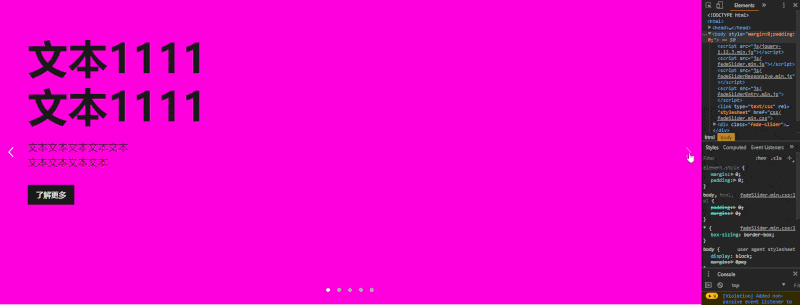
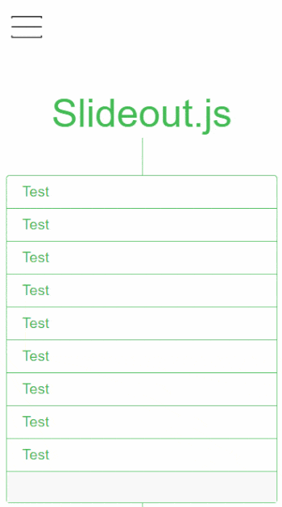

#轮播与打包编译

## gulp编译

/slider
1. npm install
2. gulp
3. open slideSlider.html / fadeSlider.html / weixinSlider.html / ThreeDimansionSlider.html / slideout.html

* 响应式滑动轮播(slideSlider.html)

* 响应式渐隐渐现轮播(fadeSlider.html)

* 微信式下拉轮播(weixinSlider.html)

* 3D轮播(ThreeDimansionSlider.html)

* 手机侧边栏(slideout.html)

## webpack打包

/webpack
1. npm install
2. npm run build
3. 打包到/dist/bundle.js
